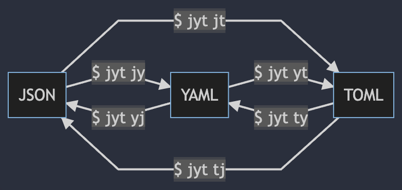

I developed `jyt`, a converter between JSON, YAML, and TOML written in Rust.



I would introduce what `jyt` can do.

## Introduction

Many tools support many extensions of configuration files; for example, ESLint supports JavaScript, YAML, and JSON. I personally use YAML for ESLint config files rather than other formats. However, blog posts often provide a config file as JSON because it is the most popular, and YAML is not - I am a minority.

It was a waste of time to convert it to YAML manually, so I developed `jyt` to convert the config file posted on blog posts to YAML.

`jyt` originated from the respective initials of JSON, YAML, and TOML.

## Features

* Written in Rust
* Supports both native and WebAssembly
* Preserves order

## Installation

You can install `jyt` with `Cargo` so that it is published on [`crates.io`](https://crates.io/crates/jyt):

```bash
$ cargo install jyt
```

`jyt` also supports WebAssembly and can be installed through [`wapm.io`](https://wapm.io/ken-matsui/jyt):

```bash
$ wapm install ken-matsui/jyt
```

## Usage

You can simply execute `jyt` as the following help.

```bash
$ jyt --help
jyt 0.1.0
Ken Matsui <26405363+ken-matsui@users.noreply.github.com>
A tridirectional converter between Json, Yaml, and Toml
USAGE:
    jyt <SUBCOMMAND>
OPTIONS:
    -h, --help       Print help information
    -V, --version    Print version information
SUBCOMMANDS:
    help            Print this message or the help of the given subcommand(s)
    json-to-toml    Convert Json to Toml (also as `json2toml`, `j2t`, and `jt`)
    json-to-yaml    Convert Json to Yaml (also as `json2yaml`, `j2y`, and `jy`)
    toml-to-json    Convert Toml to Json (also as `toml2json`, `t2j`, and `tj`)
    toml-to-yaml    Convert Toml to Yaml (also as `toml2yaml`, `t2y`, and `ty`)
    yaml-to-json    Convert Yaml to Json (also as `yaml2json`, `y2j`, and `yj`)
    yaml-to-toml    Convert Yaml to Toml (also as `yaml2toml`, `y2t`, and `yt`)
```

As diagram: 

### Examples

Since `jyt` can be used with pipes, you can directly pass the output of the `cat` command.

```yaml
$ cat ./examples/example.json | jyt json-to-yaml
---
title: TOML Example
owner:
  name: Tom Preston-Werner
database:
  server: 192.168.1.1
  ports:
    - 8000
    - 8001
    - 8002
  connection_max: 5000
  enabled: true
```

The preserving order feature can correctly execute the following command.
The example indicates that pre-converted TOML file and converting TOML -> YAML -> JSON -> TOML match.

```bash
$ test "$(cat ./examples/example.toml)" = "$(cat ./examples/example.toml | jyt ty | jyt yj | jyt jt)"

$ echo $?
0
```

> The above example will fail if your file includes data that requires special operation in a conversion, such as the `datetime` type of TOML.

For more examples, go to the examples page of README.md.

https://github.com/ken-matsui/jyt#examples

### Converting ESLint config

Let's pull an example config from the official document.

https://eslint.org/docs/user-guide/configuring/configuration-files

`.eslintrc.json`

```json
{
    "root": true,
    "extends": [
        "eslint:recommended",
        "plugin:@typescript-eslint/recommended"
    ],
    "parser": "@typescript-eslint/parser",
    "parserOptions": { "project": ["./tsconfig.json"] },
    "plugins": [
        "@typescript-eslint"
    ],
    "rules": {
        "@typescript-eslint/strict-boolean-expressions": [
            2,
            {
                "allowString" : false,
                "allowNumber" : false
            }
        ]
    },
    "ignorePatterns": ["src/**/*.test.ts", "src/frontend/generated/*"]
}
```

Convert the config to YAML by the following command:

```bash
cat .eslintrc.json | jyt jy > .eslintrc.yaml
```

You will receive the same output below:

`.eslintrc.yaml`

```yaml
---
root: true
extends:
  - "eslint:recommended"
  - "plugin:@typescript-eslint/recommended"
parser: "@typescript-eslint/parser"
parserOptions:
  project:
    - "./tsconfig.json"
plugins:
  - "@typescript-eslint"
rules:
  "@typescript-eslint/strict-boolean-expressions":
    - 2
    - allowString: false
      allowNumber: false
ignorePatterns:
  - src/**/*.test.ts
  - src/frontend/generated/*
```

## WebAssembly support

As mentioned before, you can try `jyt` on the web because it supports WebAssembly.

https://wapm.io/ken-matsui/jyt

Click on `Open in Shell` to run `jyt` from the above site.

## Conclusion

I think `jyt` would be helpful as a lightweight interconversion CLI.

I hope this article and `jyt` help you.
